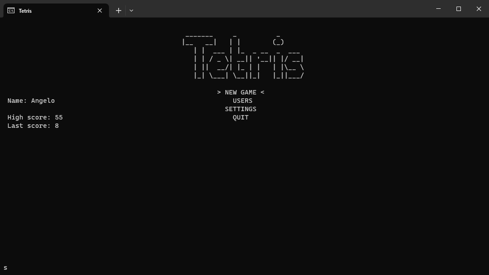
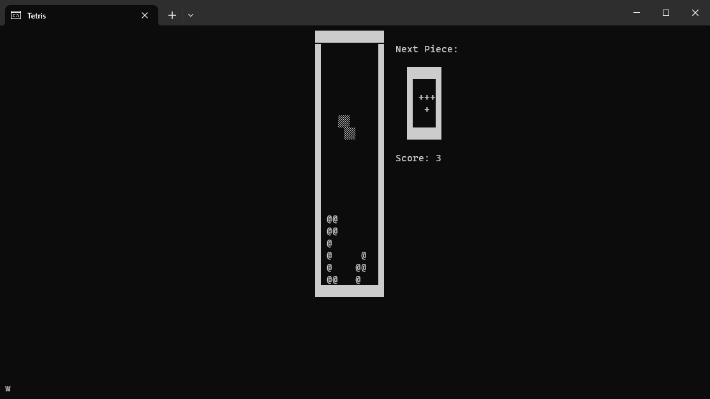

# Tetris
This is my clone of Tetris running on Windows in the terminal.
the project consists of the game itself and a menu featuring a little user and high score system.
Additionally, there is a convenience class that lets me use the terminal like a canvas (Screen.cs)

Enjoy

## Screenshots
---

